# Data Science Portfolio: Statistical Methods & Predictive Modeling

> **Weeks 1 & 2: From Business Alignment to Evidence-Based Decision Making**

## Project Overview

This repository documents a complete data science workflow. It transitions from the strategic planning of **Week 1** (CRISP-DM, Data Maturity, and Feature Engineering) to the mathematical execution of **Week 2** (Hypothesis Testing, Correlation, and Regression). The goal is to move beyond "gut feeling" and use mathematical rigor to validate assumptions, identify patterns, and predict future outcomes.

## 🛠️ Skills Demonstrated

* **Strategic Planning:** CRISP-DM lifecycle, 5 Whys Root Cause Analysis, and DIKW Pyramid.
* **Hypothesis Testing:** -tests, ANOVA, and Chi-Square analysis.
* **Correlation:** Pearson () and Spearman () coefficients for relationship mapping.
* **Regression:** Simple and Multiple Linear Regression using OLS (Ordinary Least Squares).
* **Model Evaluation:** Interpreting , Adjusted , and RSS (Residual Sum of Squares).
* **Risk Assessment:** Evaluating Sensitivity vs. Specificity and Prediction Intervals.

---

## Week 1: Strategic Foundations

### 1. The CRISP-DM Framework

Before touching code, I utilize the **CRISP-DM** lifecycle to ensure technical work solves a real business problem.

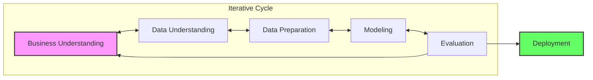

### 2. Business Logic & Data Understanding

* **DIKW Pyramid:** Defining the "Wisdom" required for action.

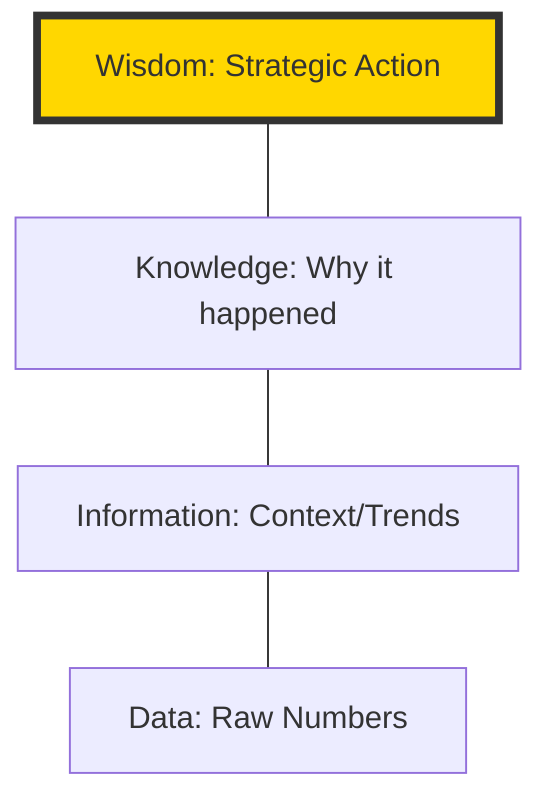

* **The 5 Vs:** Assessing Volume, Velocity, Variety, Veracity, and Value.

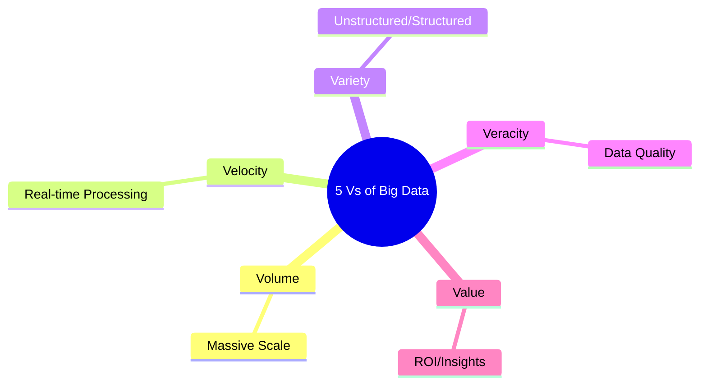

* **Feature Engineering:** Applying human ingenuity to create variables that help models see hidden patterns.

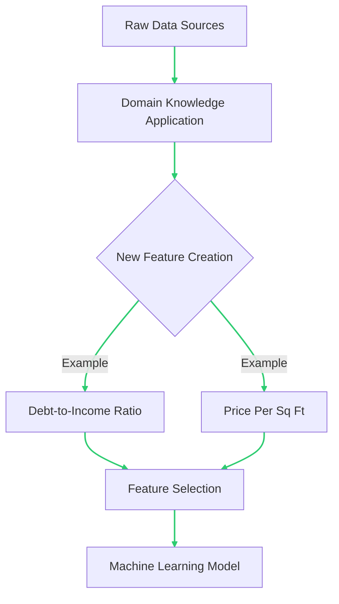

### 3. Data Classification

Understanding data types is the first step in selecting the correct statistical tool.

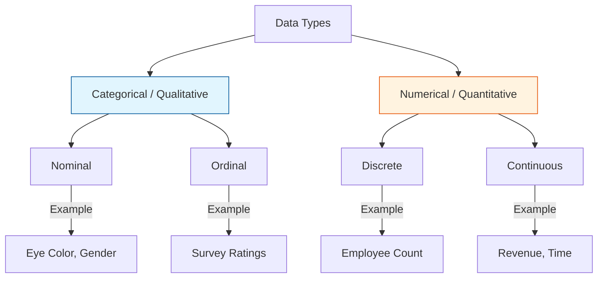

---

## Master Decision Logic Flow

This framework is used throughout the activities to select the appropriate statistical test.

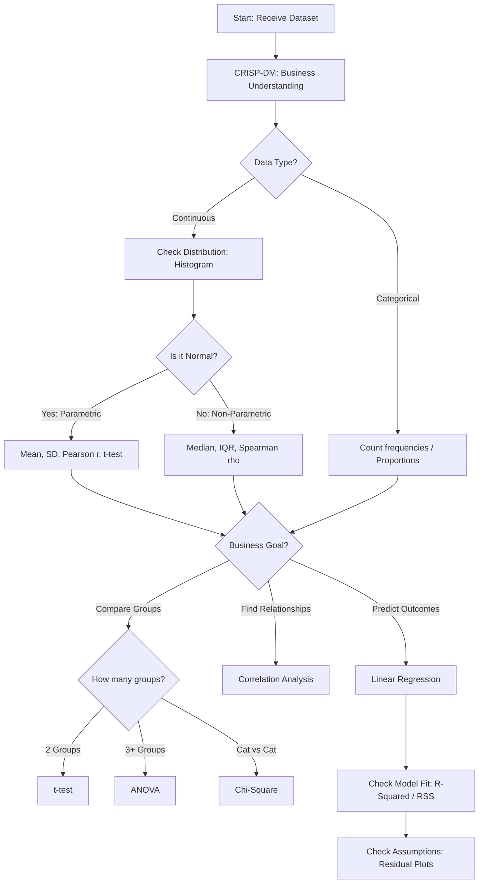

---

## Portfolio Activities

### Activity 2.1.3: Hypothesis Testing

* **Objective:** Validate assumptions across scenarios (Price, Productivity, Market Research, QC, and Product Lines).
* **Technical Implementation:** Utilized `scipy.stats` to perform t-tests and ANOVA.
* **Key Insight:** Separated "signal" from "noise" by interpreting -values against .

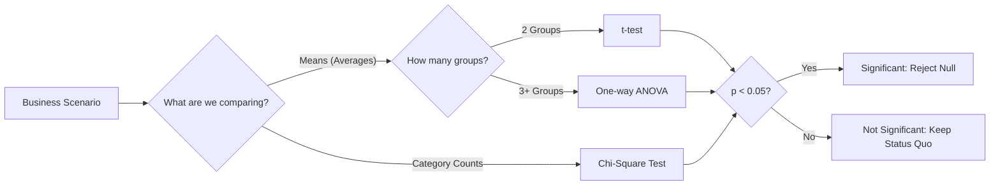

### Activity 2.2.3: Interpreting Correlation

* **Objective:** Analyze lifestyle impacts (BMI, children) on medical insurance costs.
* **Technical Implementation:** Computed Pearson and Spearman coefficients; visualized relationships via Seaborn.

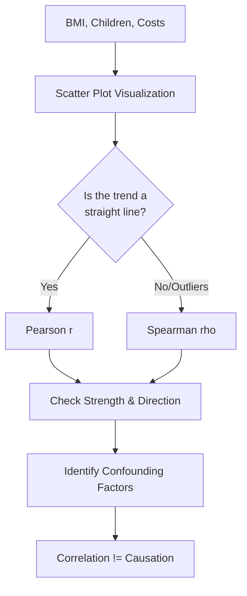

### Activity 2.3.5: Building Predictive Models

* **Objective:** Predict customer loyalty based on product quality and brand awareness.
* **Technical Implementation:** Built a Multiple Linear Regression model using `statsmodels`.
* **Business Impact:** Provided coefficient-based insights (e.g., "A 1-unit increase in quality yields a specific increase in loyalty").

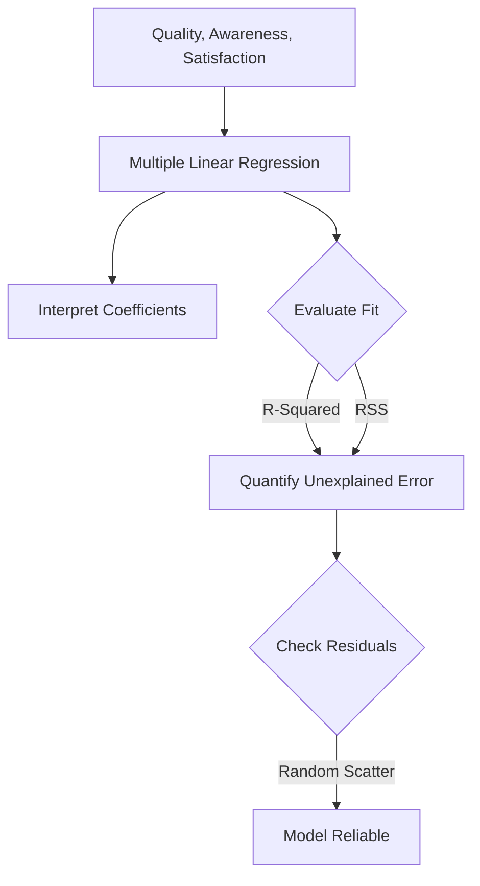

---

## 🔍 Assumption & Diagnostic Checks

### 1. Model Diagnostic Flow

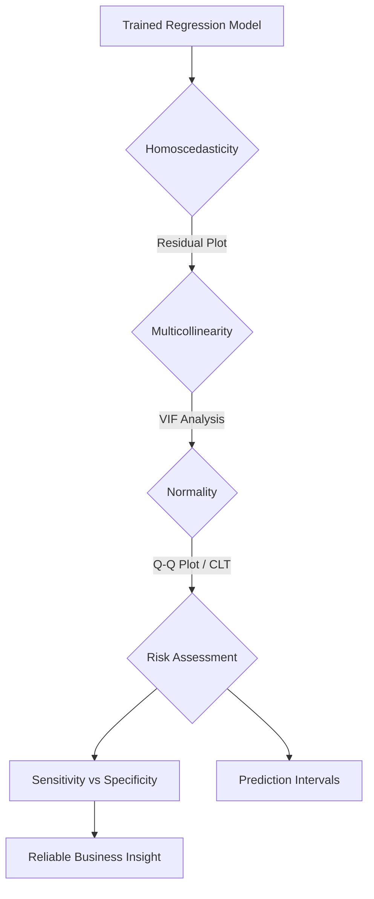

### 2. Normality & CLT

* **Central Limit Theorem:** Leveraged the CLT to ensure sample means follow a normal distribution, allowing for valid inference.

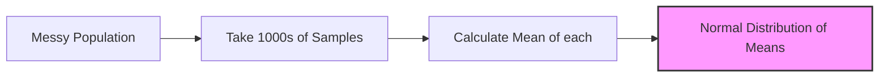

### 3. Multicollinearity & Risk

* **VIF Screening:** Screened independent variables to ensure they were not redundant.

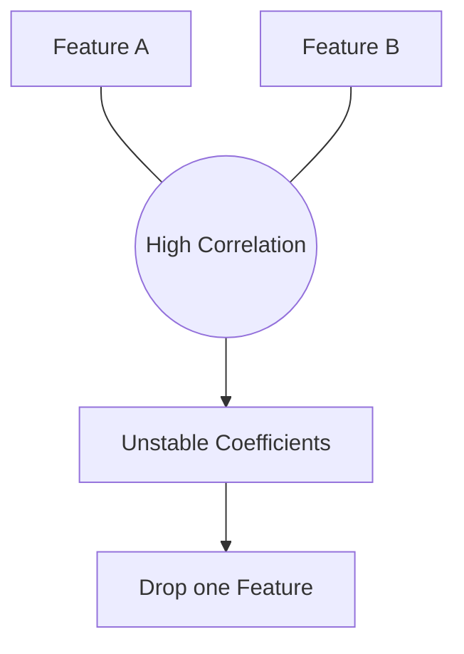

* **Homoscedasticity:** Verified constant variance in residuals.
* **Sensitivity vs. Specificity:** Balanced catching "truth" vs. avoiding "false alarms."

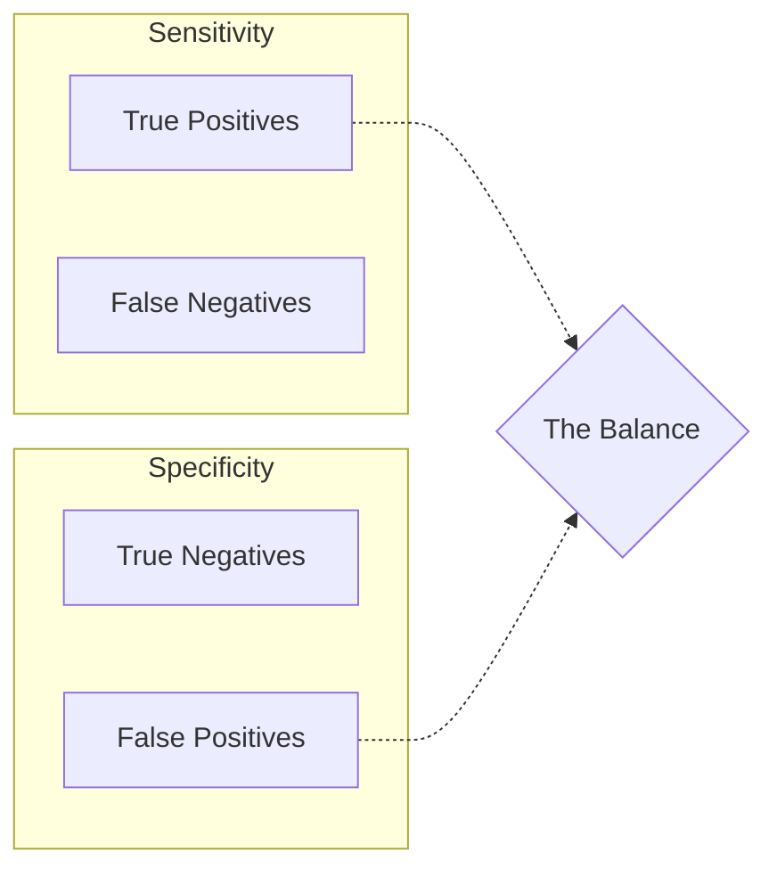

### 4. Prediction Intervals

Provided a range for individual variability, distinct from population averages.

Prediction vs. Confidence Intervals Logic
This diagram explains why one is wider than the other and when to use each for business decisions.

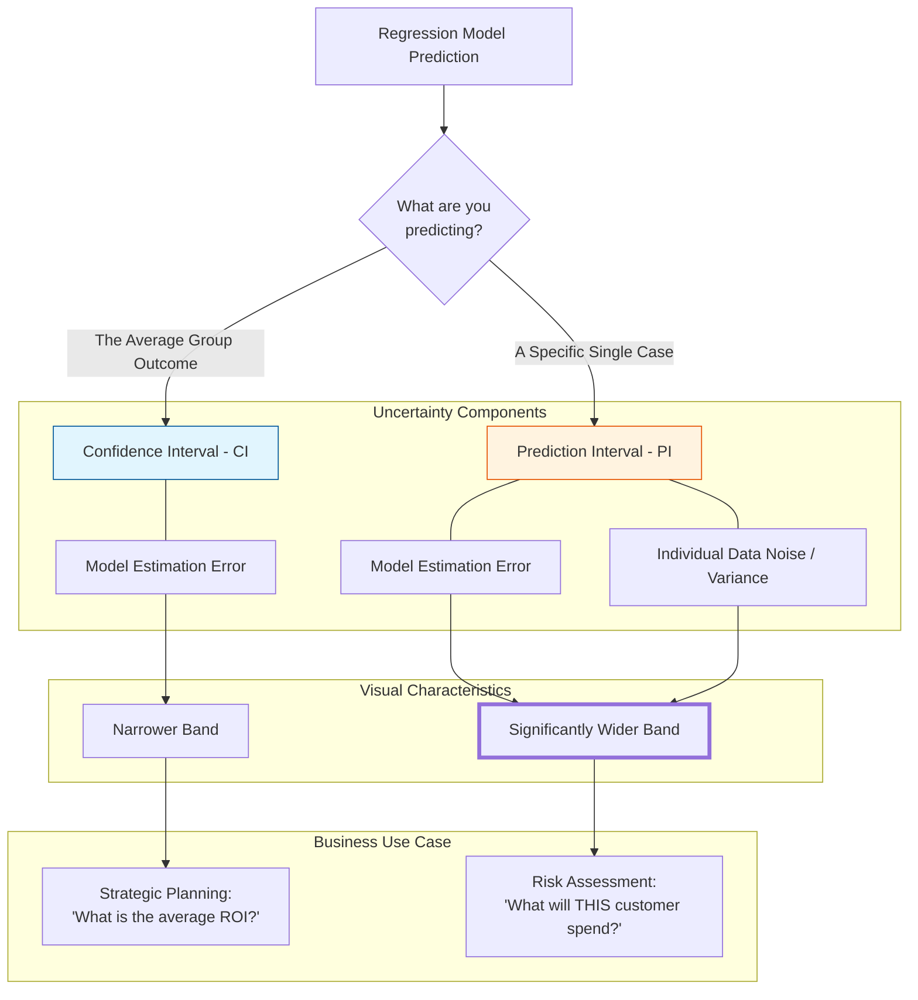

Visual Representation Guide
When you look at a regression plot:

Confidence Interval (CI): Think of this as the "wiggle room" of the best-fit line itself. If you ran the experiment again, the line might move slightly; the CI shows where the mean line likely stays.

Prediction Interval (PI): Think of this as the "Scatter Zone." It covers nearly all your data points. It is wider because even if you have the perfect line, individual people/events are unpredictable and "noisy."
---

## Technologies Used

* **Language:** Python 3.x
* **Libraries:** `Pandas`, `NumPy`, `Matplotlib`, `Seaborn`, `Scipy.stats`, `Statsmodels`, `Scikit-Learn`
* **Documentation:** Mermaid.js, Markdown
