# Data Science Portfolio: Statistical Methods and Predictive Modeling

## Project Overview

This repository contains a series of technical analyses focused on applying advanced statistical techniques to solve business problems. The goal of this work is to move beyond "gut feeling" and use mathematical rigor to validate assumptions, identify patterns, and predict future outcomes. This portfolio follows the transition from strategic business framing to predictive execution.

## Skills Demonstrated

* **Strategic Planning:** CRISP-DM lifecycle, 5 Whys Root Cause Analysis, and DIKW Pyramid.
* **Hypothesis Testing:** -tests, ANOVA, and Chi-Square analysis.
* **Correlation:** Pearson () and Spearman () coefficients for relationship mapping.
* **Regression:** Simple and Multiple Linear Regression using OLS (Ordinary Least Squares).
* **Model Evaluation:** Interpreting , Adjusted , and RSS (Residual Sum of Squares).
* **Risk Assessment:** Evaluating Sensitivity vs. Specificity and Prediction Intervals.

---

## Week 1: Strategic Foundations

### 1. The CRISP-DM Framework

Before performing analysis, I utilize the **CRISP-DM** lifecycle to ensure technical work aligns with business ROI.

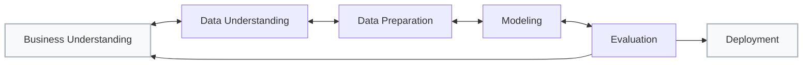

* **Business Understanding (DIKW Pyramid):** Moving from raw data to actionable wisdom.

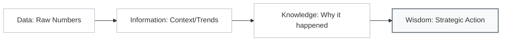

### 2. Data Classification

Understanding data types determines the mathematical toolkit required for the project.

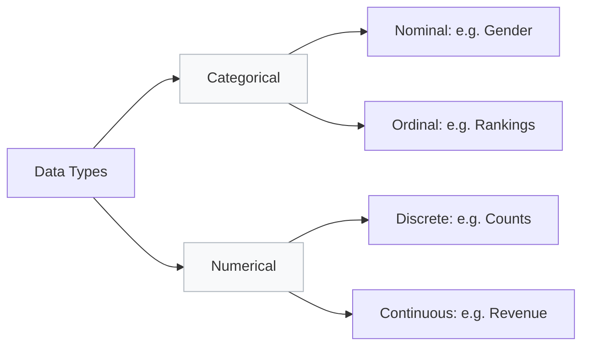

---

## Portfolio Activities

### Activity 2.1.3: Hypothesis Testing

* **Objective:** Validate business assumptions across five scenarios (**Price, Productivity, Market Research, QC, and Product Lines**).
* **Implementation:** Utilized `scipy.stats` to separate "signal" from "noise" by interpreting -values against .

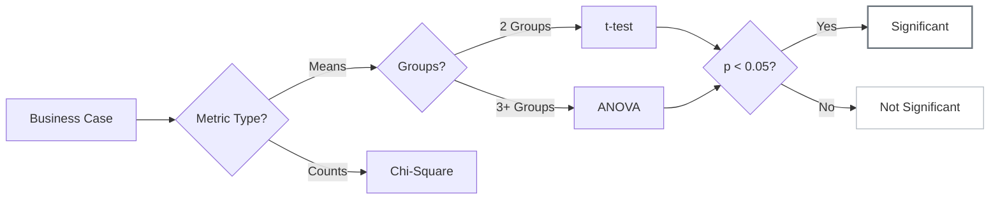

### Activity 2.2.3: Interpreting Correlation

* **Objective:** Analyze lifestyle impacts (**BMI, children**) on medical insurance costs for an investment firm.
* **Implementation:** Computed Pearson () and Spearman () coefficients to account for outliers and non-linear trends.

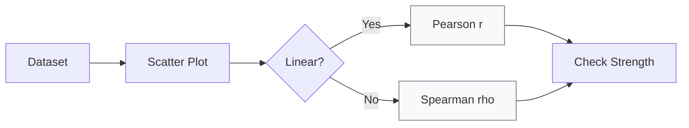

### Activity 2.3.5: Building Predictive Models

* **Objective:** Predict customer loyalty for a national retailer based on **product quality, brand awareness, and satisfaction**.
* **Implementation:** Built a Multiple Linear Regression model using **OLS (Ordinary Least Squares)**.

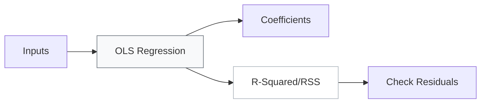

---

## Assumption and Diagnostic Checks

### 1. Central Limit Theorem (CLT)

Explains why we can use Normal Distribution math even if the raw data looks non-normal.

[Image illustrating the Central Limit Theorem showing how different population distributions result in normal sampling distributions]

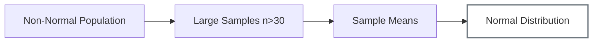

### 2. Prediction vs. Confidence Intervals

Diagnostic check for the difference between group averages and individual variability.

[Image comparing Confidence Intervals and Prediction Intervals on a regression plot, showing the PI as a wider band]

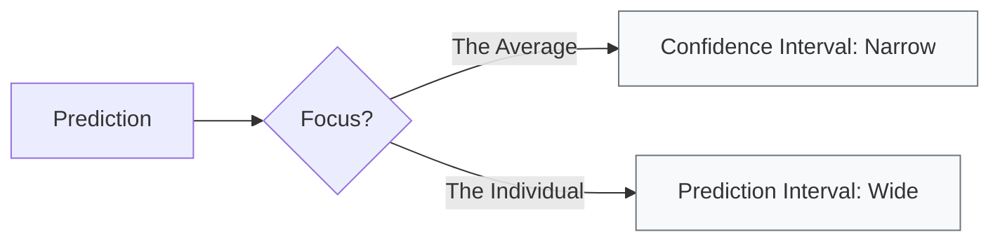

### 3. Risk Assessment (Sensitivity vs. Specificity)

Evaluated trade-offs to balance between missing positives and raising false alarms.

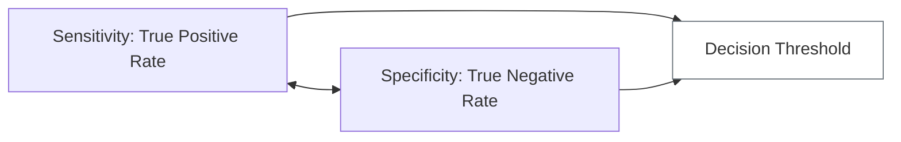
---

### Statistical Visual Cheat Sheet

| If the Business Goal is... | Use this Visual Plot... | Perform this Test... | Look for this Visual Pattern... |
| --- | --- | --- | --- |
| **Check if data is "Normal"** | **Histogram / QQ Plot** | Shapiro-Wilk Test | A bell-shaped curve or points following a straight line. |
| **Compare 2 Group Averages** | **Box Plot** | Independent t-test | Do the boxes overlap? Large gaps mean a significant difference. |
| **Find Linear Relationships** | **Scatter Plot** | Pearson () | Points forming a clear, straight "up" or "down" slope. |
| **Predict a Continuous Value** | **Regression Plot** | OLS Regression | The line should pass through the "center of mass" of the points. |
| **Validate Regression Reliability** | **Residual Plot** | Breusch-Pagan Test | A random "cloud" of dots with no distinct shape or "fan." |
| **Compare Categorical Proportions** | **Mosaic / Bar Chart** | Chi-Square () | Large differences in the heights/areas of the bars. |

---

### Study Tip: The "Visual Diagnostic" Workflow

When you are taking your test or working on a project, follow this horizontal logic:

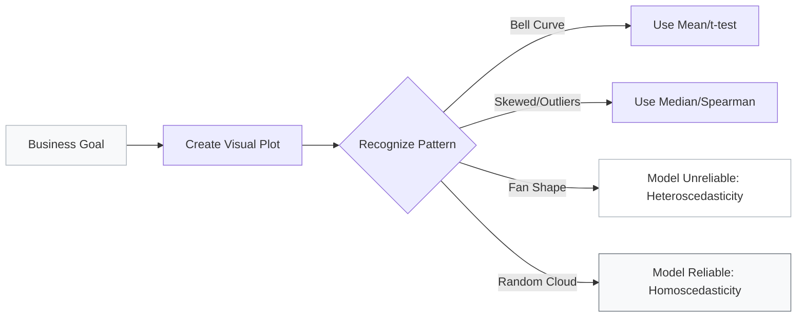

### Final Study Checklist

1. **Confidence vs. Prediction:** Can I see the "narrow" band (average) vs. the "wide" band (individual)?
2. **P-Value:** Is my result deep enough in the "tail" to be significant?
3. **R-Squared:** Does my regression line actually explain the "scatter" of the points?

---

## Glossary of Mathematical Terms

| Term | Definition |
| --- | --- |
| **-value** | The probability that the observed results happened by chance. If , results are significant. |
| **OLS** | **Ordinary Least Squares**: Minimizes the sum of the squares of the vertical deviations from the line. |
| **RSS** | **Residual Sum of Squares**: Measure of the discrepancy between the data and the model. |
| **** | The percentage of variance in the dependent variable explained by the model. |
| **Adjusted ** | Modified  that accounts for the number of predictors to prevent overfitting. |
| **Homoscedasticity** | Condition where the variance of error is constant across independent variables. |

---

To round out your study guide, here is a **Python Visual Cheat Sheet**. For a data scientist, the code is just the tool to generate the visual patterns we discussed.

This sheet maps the **Visual Pattern** to the **Python Library** and the **Specific Function** you need to know for your exam or projects.

---

### Python Statistical Mapping

| Business Task | Library | Primary Function | What the Code Does |
| --- | --- | --- | --- |
| **Check Distribution** | `Seaborn` | `sns.histplot(data, kde=True)` | Draws the histogram and a smooth "bell" line (KDE). |
| **Compare Groups** | `Seaborn` | `sns.boxplot(x='group', y='value')` | Shows the median and "spread" (IQR) for each group. |
| **Correlation Matrix** | `Seaborn` | `sns.heatmap(df.corr(), annot=True)` | Colors the relationships (1.0 is perfect, 0 is noise). |
| **Linear Regression** | `Statsmodels` | `sm.OLS(y, X).fit()` | Calculates the best-fit line and provides the p-values. |
| **Verify Residuals** | `Matplotlib` | `plt.scatter(model.predict(), model.resid)` | Plots the "Error Cloud" to check for Homoscedasticity. |

---

### The Python Logic Flow (Horizontal)

This is the standard order of operations when you are coding your analysis:

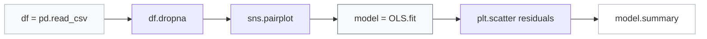

### Visualizing the "Perfect" Model in Python

When you run your diagnostics, you are looking for these specific Python outputs to feel confident in your results:

1. **The Summary Table:** In `statsmodels`, look at `Prob (F-statistic)`. If that is , your whole model is better than guessing.
2. **The Pairplot:** Use `sns.pairplot(df)`. It creates a grid of every scatter plot possible in your data. It is the fastest way to "see" which variables have a relationship.
3. **The Q-Q Plot:** Use `sm.qqplot(resid, line='s')`. If the dots follow the line, your errors are normally distributed—meaning your model is statistically "safe."

---

## Technologies Used

* **Language:** Python 3.x
* **Libraries:** Pandas, NumPy, Matplotlib, Seaborn, Scipy.stats, Statsmodels, Scikit-Learn
