# Data Science Portfolio: Statistical Methods and Predictive Modeling

## Project Overview

This repository contains a series of technical analyses focused on applying advanced statistical techniques to solve business problems. The goal of this work is to move beyond "gut feeling" and use mathematical rigor to validate assumptions, identify patterns, and predict future outcomes. This portfolio follows the transition from strategic business framing to predictive execution.

## Skills Demonstrated

* **Strategic Planning:** CRISP-DM lifecycle, 5 Whys Root Cause Analysis, and DIKW Pyramid.
* **Hypothesis Testing:** t-tests, ANOVA, and Chi-Square analysis.
* **Correlation:** Pearson (r) and Spearman (rho) coefficients for relationship mapping.
* **Regression:** Simple and Multiple Linear Regression using OLS (Ordinary Least Squares).
* **Model Evaluation:** Interpreting R-Squared, Adjusted R-Squared, and RSS (Residual Sum of Squares).
* **Risk Assessment:** Evaluating Sensitivity vs. Specificity and Prediction Intervals.

---

## Week 1: Strategic Foundations

### 1. The CRISP-DM Framework

Before performing analysis, I utilize the **CRISP-DM** (Cross-Industry Process for Data Mining) lifecycle to ensure technical work aligns with business ROI.

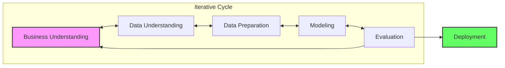

* **Business Understanding (DIKW Pyramid):** Moving from raw data to actionable wisdom.

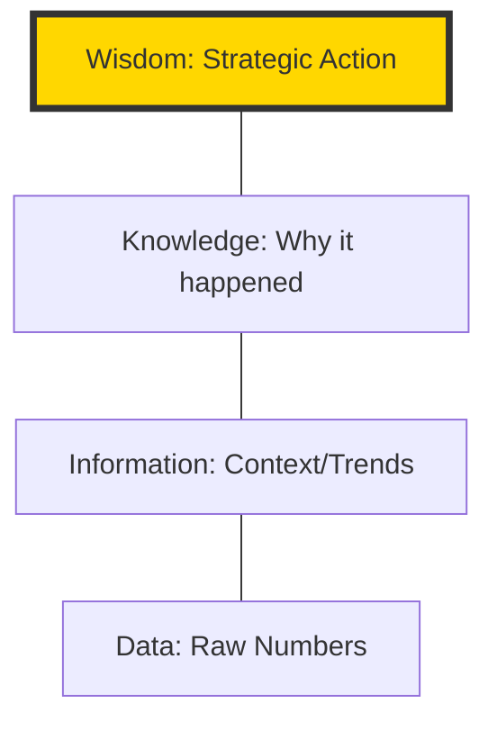

* **Data Understanding (The 5 Vs):** Assessing **Volume, Velocity, Variety, Veracity, and Value** to determine data maturity.

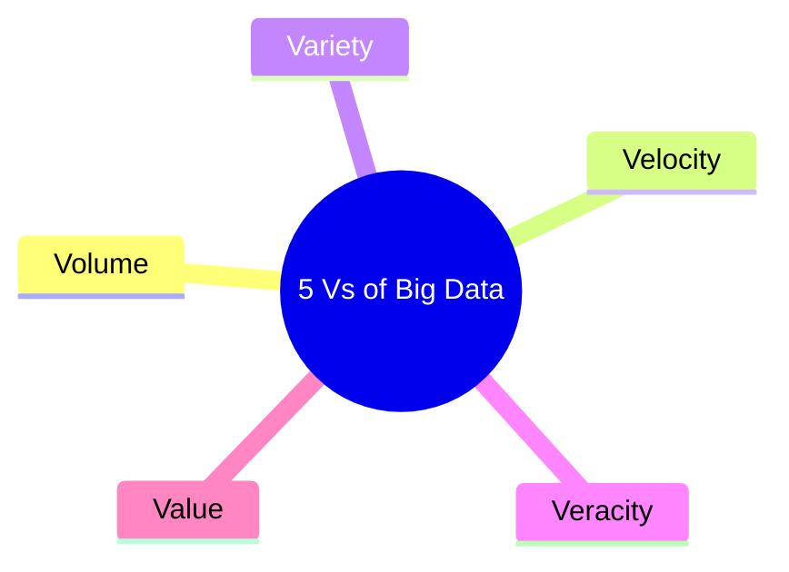

* **Feature Engineering:** Applying human ingenuity to create new variables (e.g., **Debt-to-Income ratio**) that provide context to "Black Box" models.

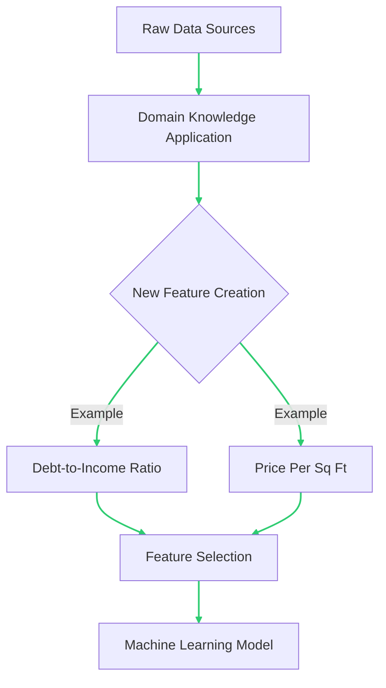

### 2. Data Classification and Maturity

Understanding data types determines the mathematical toolkit required for the project.

* **Categorical (Nominal/Ordinal):** For grouping and ranking.
* **Numerical (Discrete/Continuous):** For counting and measuring.

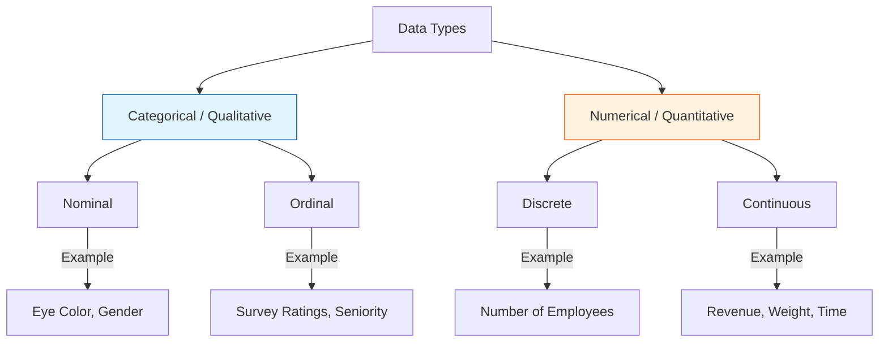

---

## Master Decision Logic Flow

The following diagram illustrates the end-to-end framework used to select the appropriate statistical test based on data types and business goals.

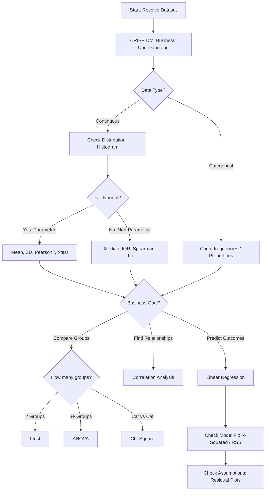

---

## Portfolio Activities

### Activity 2.1.3: Hypothesis Testing

* **Objective:** Validate business assumptions across five scenarios (**Price, Productivity, Market Research, QC, and Product Lines**).
* **Technical Implementation:** Utilized `scipy.stats` to perform t-tests and ANOVA to separate "signal" from "noise."
* **Key Insight:** Interpreted p-values against a significance level (alpha) of **0.05** to determine if results were statistically significant or due to chance.

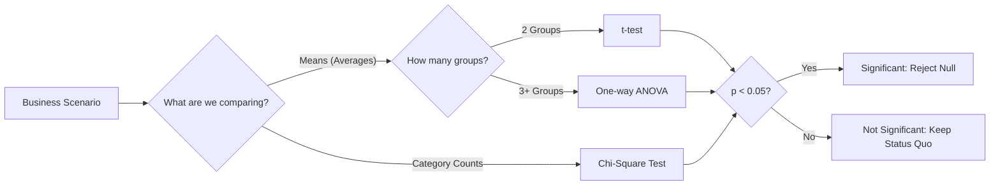

### Activity 2.2.3: Interpreting Correlation

* **Objective:** Analyze lifestyle impacts (**BMI, children**) on medical insurance costs for an investment firm.
* **Technical Implementation:** Computed **Pearson (r)** for linear trends and **Spearman (rho)** for non-linear relationships or outliers.
* **Key Insight:** Identified confounding variables (like **Age**) to avoid the "Correlation implies Causation" fallacy.

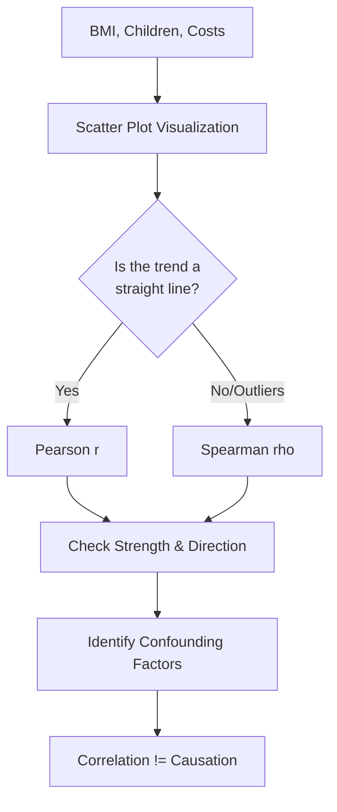

### Activity 2.3.5: Building Predictive Models

* **Objective:** Predict customer loyalty for a national retailer based on **product quality, brand awareness, and satisfaction**.
* **Technical Implementation:** Built a Multiple Linear Regression model using **OLS (Ordinary Least Squares)**.
* **Evaluation:** Interpreted **Adjusted R-Squared** to ensure model complexity did not lead to overfitting and minimized **RSS**.
* **Business Impact:** Provided coefficient-based insights (e.g., "A 1-unit increase in perceived quality yields a measurable increase in loyalty score").

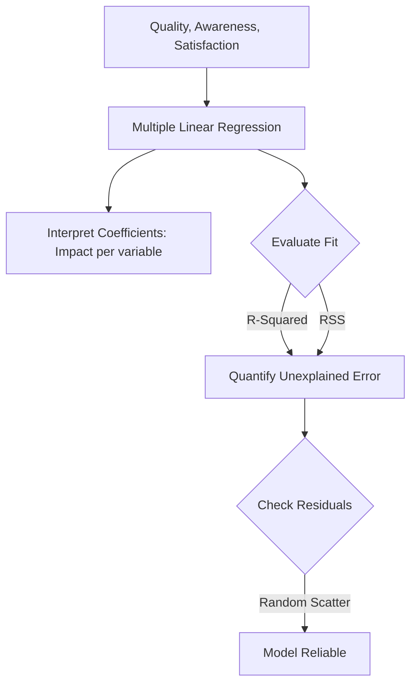

---

## Assumption and Diagnostic Checks

### 1. Central Limit Theorem (CLT)

The CLT is the "Safety Net" of statistics. It explains why we can use Normal Distribution math even if the raw data looks "messy" or non-normal.

[Image illustrating the Central Limit Theorem showing how different population distributions result in normal sampling distributions]

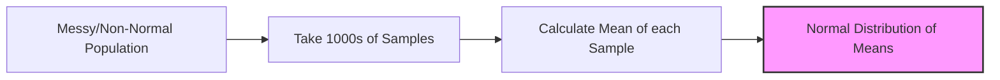

### 2. Prediction vs. Confidence Intervals

This diagnostic check accounts for the difference between group averages and individual variability.

[Image comparing Confidence Intervals and Prediction Intervals on a regression plot, showing the PI as a wider band]

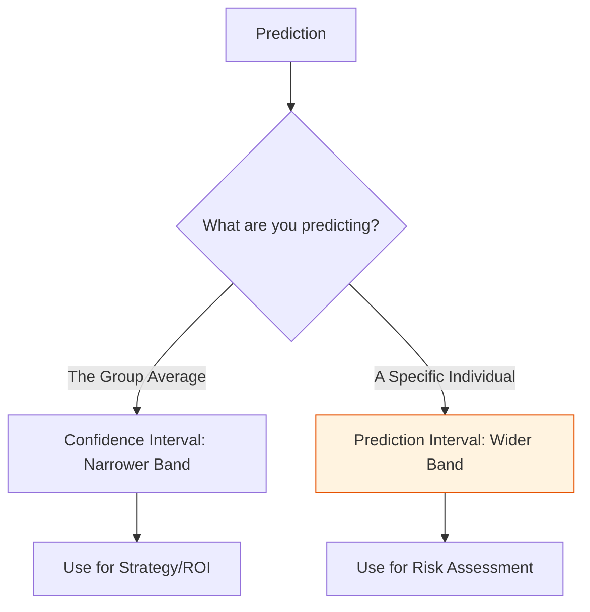

### 3. Model Reliability Audits

* **Homoscedasticity:** Verified constant variance in residuals to ensure consistent prediction accuracy.
* **Multicollinearity:** Screened independent variables using **VIF Analysis** to ensure they were not redundant.
* **Risk Assessment (Sensitivity vs. Specificity):** Evaluated trade-offs to balance between missing positives and raising false alarms.

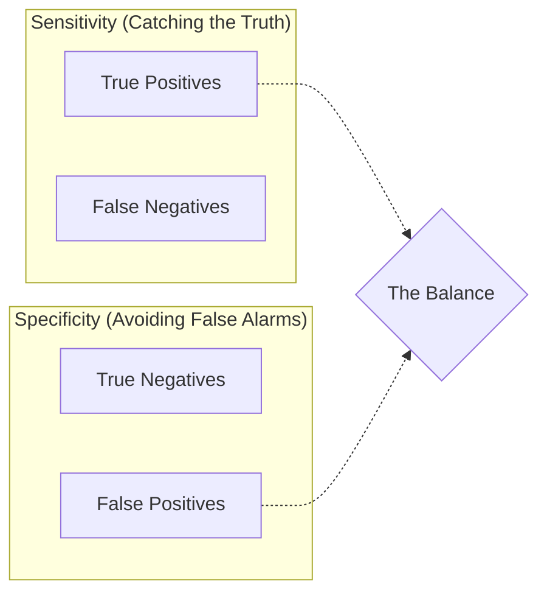

---

## Glossary of Mathematical Terms for Study

| Term | Definition |
| --- | --- |
| **p-value** | The probability that the observed results happened by chance. If , we reject the Null Hypothesis. |
| **OLS (Ordinary Least Squares)** | A method for estimating the parameters in a linear regression model by minimizing the sum of the squares of the vertical deviations between each data point and the fitted line. |
| **RSS (Residual Sum of Squares)** | A measure of the discrepancy between the data and an estimation model. A small RSS indicates a tight fit of the model to the data. |
| **R-Squared ()** | The proportion of the variance for a dependent variable that is explained by an independent variable or variables in a regression model. |
| **Adjusted R-Squared** | A modified version of R-squared that has been adjusted for the number of predictors in the model; it only increases if the new term improves the model more than would be expected by chance. |
| **VIF (Variance Inflation Factor)** | A measure of the amount of multicollinearity in a set of multiple regression variables. High VIF (usually > 5 or 10) indicates high correlation between predictors. |
| **Homoscedasticity** | A condition in which the variance of the residual (error) is constant across all levels of the independent variables. |

---

## Technologies Used

* **Language:** Python 3.x
* **Libraries:** Pandas, NumPy, Matplotlib, Seaborn, Scipy.stats, Statsmodels, Scikit-Learn
* **Documentation:** Mermaid.js, Markdown
