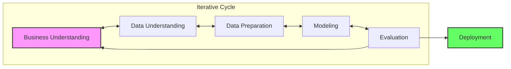
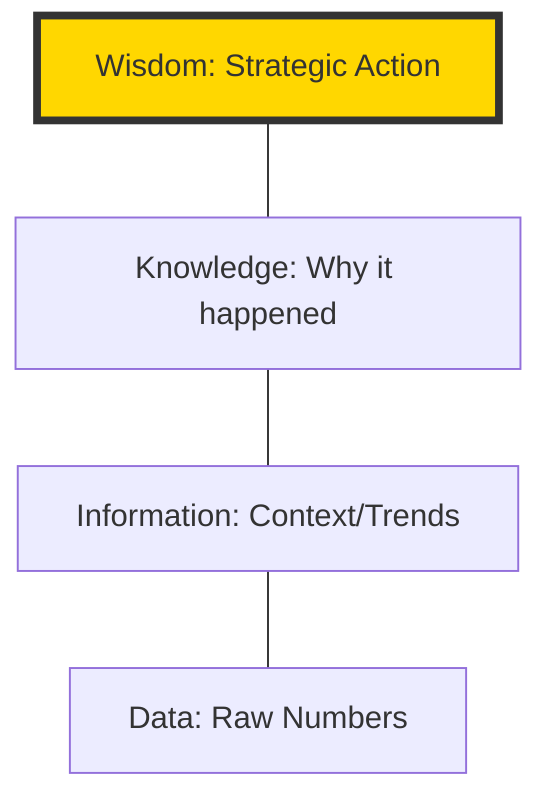
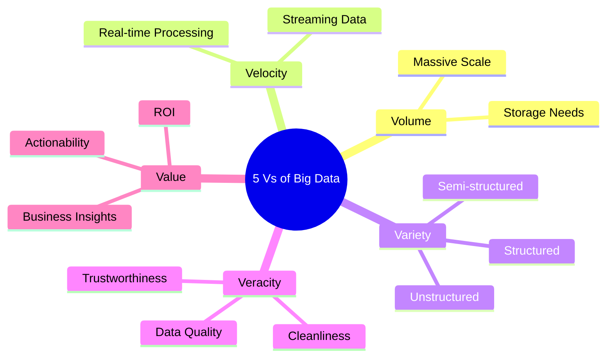
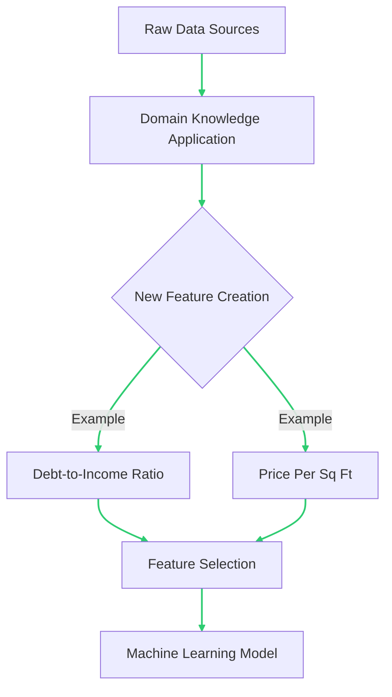
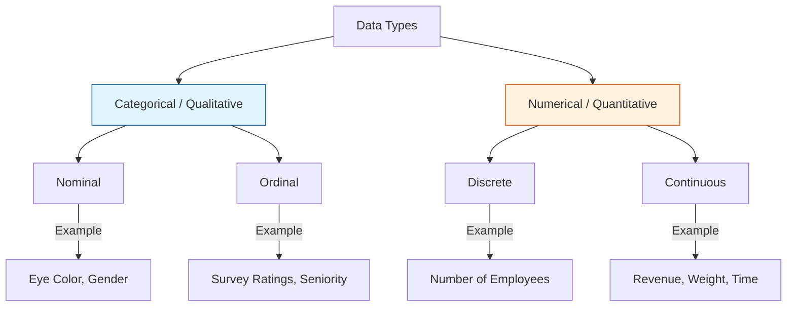
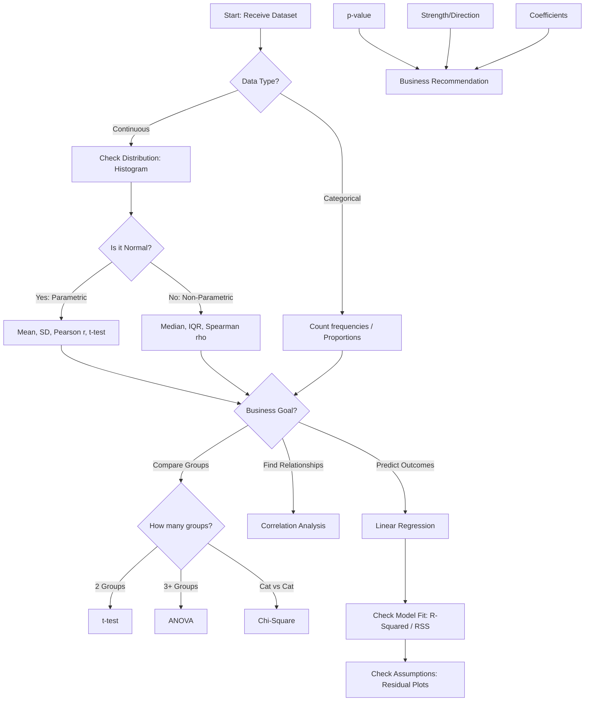
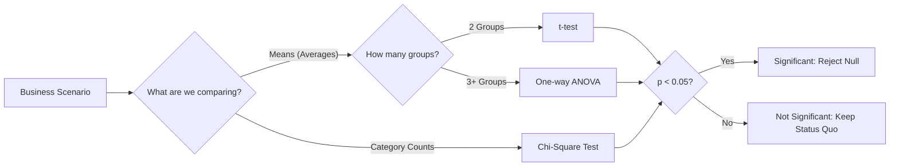
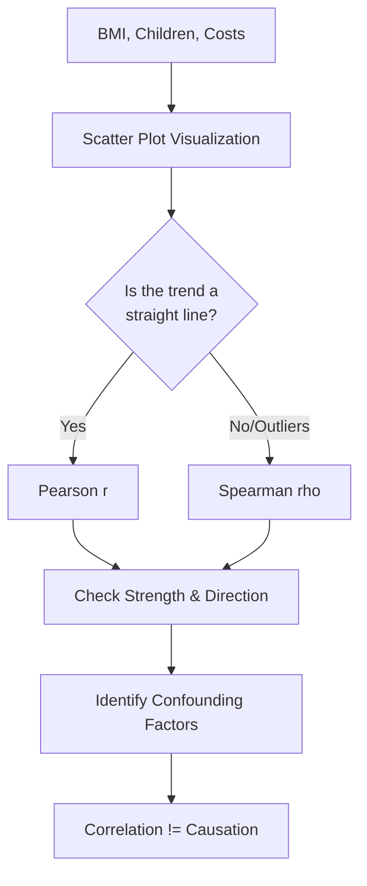
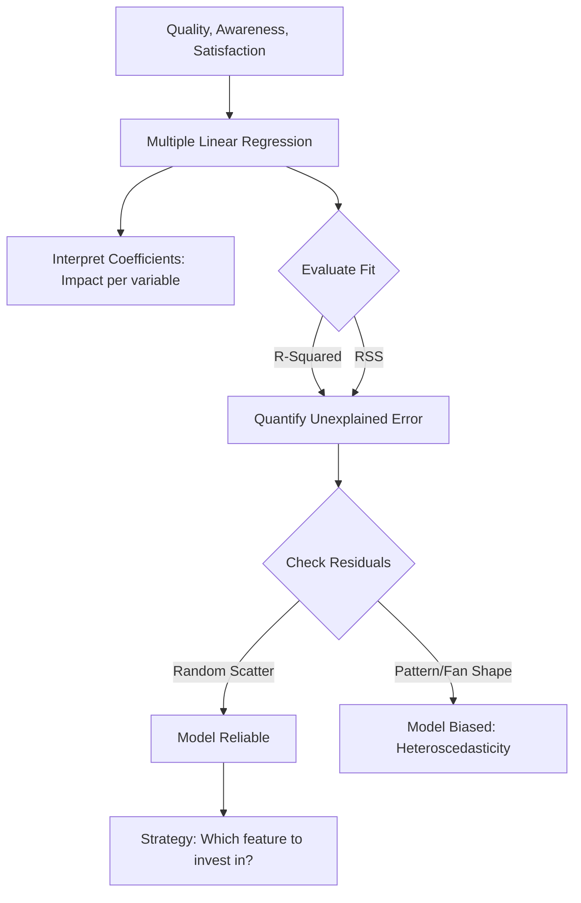

# Data Science Portfolio: Statistical Methods & Predictive Modeling

> **Week 2: From Intuition to Evidence-Based Decision Making**

## Project Overview

This repository documents a complete data science workflow. It transitions from the strategic planning of Week 1 (CRISP-DM, Data Maturity, and Feature Engineering) to the mathematical execution of Week 2 (Hypothesis Testing, Correlation, and Regression). The goal is to move beyond "gut feeling" and use mathematical rigor to validate assumptions and predict outcomes.

## 🛠️ Skills Demonstrated
* **Strategic Planning:** CRISP-DM lifecycle, 5 Whys Root Cause Analysis, and DIKW Pyramid.
* **Hypothesis Testing:** -tests, ANOVA, and Chi-Square analysis.
* **Correlation:** Pearson () and Spearman () coefficients for relationship mapping.
* **Regression:** Simple and Multiple Linear Regression using OLS (Ordinary Least Squares).
* **Model Evaluation:** Interpreting , Adjusted , and RSS (Residual Sum of Squares).
* **Risk Assessment:** Evaluating Sensitivity vs. Specificity and Prediction Intervals.

---

Week 1: Strategic Foundations
1. The CRISP-DM Framework
Before touching code, I utilize the CRISP-DM lifecycle to ensure technical work solves a real business problem.

Business Understanding: Defining the "Wisdom" required for action.

Data Understanding: Assessing the 5 Vs of Big Data (Volume, Velocity, Variety, Veracity, and Value).

Feature Engineering: Applying human ingenuity to create new variables (e.g., "Debt-to-Income ratio") that help models see patterns they would otherwise miss.

    
2. Data Classification
Understanding data types is the first step in selecting the correct statistical tool:

Categorical (Nominal/Ordinal): Used for identification and ranking.

Numerical (Discrete/Continuous): Used for counting and precise measuring.

---

## Decision Logic Flow

The following diagram illustrates the decision-making framework used throughout these activities to select the appropriate statistical test based on data types and business goals.

---

## Portfolio Activities

###  Activity 2.1.3: Hypothesis Testing

Objective: Validate assumptions across five scenarios (Price, Productivity, Market Research, QC, and Product Lines).
Implementation: Used scipy.stats to separate "signal" from "noise" by interpreting $p$-values against a significance level ($\alpha$) of 0.05.

* **Objective:** Validate business assumptions across five scenarios (Price, Productivity, Market Research, QC, and Product Lines).
* **Technical Implementation:** Utilized `scipy.stats` to perform t-tests and ANOVA.
* **Key Insight:** Separated "signal" from "noise" by interpreting -values against a significance level () of **0.05**.
---
### Activity 2.2.3: Interpreting Correlation

Objective: Analyze lifestyle impacts (BMI, children) on medical insurance costs.

Implementation: Evaluated Pearson vs. Spearman to account for outliers and non-linear trends.

Insight: Identified confounding variables (like Age) to avoid the "Correlation implies Causation" fallacy.

* **Objective:** Analyze lifestyle impacts (BMI, children) on medical insurance costs for an investment firm.
* **Technical Implementation:** Computed Pearson and Spearman coefficients; visualized relationships via Seaborn scatterplots.
* **Key Insight:** Identified confounding variables (like Age) to avoid the "Correlation implies Causation" fallacy.
---
### 📈 Activity 2.3.5: Building Predictive Models
Objective: Predict customer loyalty for a national retailer.
Implementation: Built a Multiple Linear Regression model using statsmodels and scikit-learn.
Evaluation: Optimized the model by minimizing RSS and analyzing Adjusted $R^2$ to prevent overfitting.

* **Objective:** Predict customer loyalty for a national retailer based on product quality and brand awareness.
* **Technical Implementation:** Built a Multiple Linear Regression model using `statsmodels` and `scikit-learn`.
* **Evaluation:** Optimized the model by minimizing RSS and analyzing Adjusted  to prevent overfitting.
* **Business Impact:** Provided coefficient-based insights (e.g., "A 1-unit increase in perceived quality yields a  increase in loyalty").

---

## Assumption & Diagnostic Checks

To ensure model reliability, I performed the following diagnostic checks:

Homoscedasticity: Verified constant variance in residuals to ensure consistent prediction accuracy.
Central Limit Theorem: Leveraged the CLT to ensure that sample means follow a normal distribution, allowing for valid inference.
Risk Assessment: Evaluated Sensitivity vs. Specificity trade-offs to balance between missing positives and raising false alarms.

* **Homoscedasticity:** Verified constant variance in residuals to ensure consistent prediction accuracy.
* **Multicollinearity:** Screened independent variables to ensure they were not redundant.
* **Prediction Intervals:** Provided a range for new observations to account for individual variability.

---

## Technologies Used

* **Language:** Python 3.x
* **Libraries:** `Pandas`, `NumPy`, `Matplotlib`, `Seaborn`, `Scipy.stats`, `Statsmodels`, `Scikit-Learn`
* **Documentation:** Mermaid.js, Markdown

