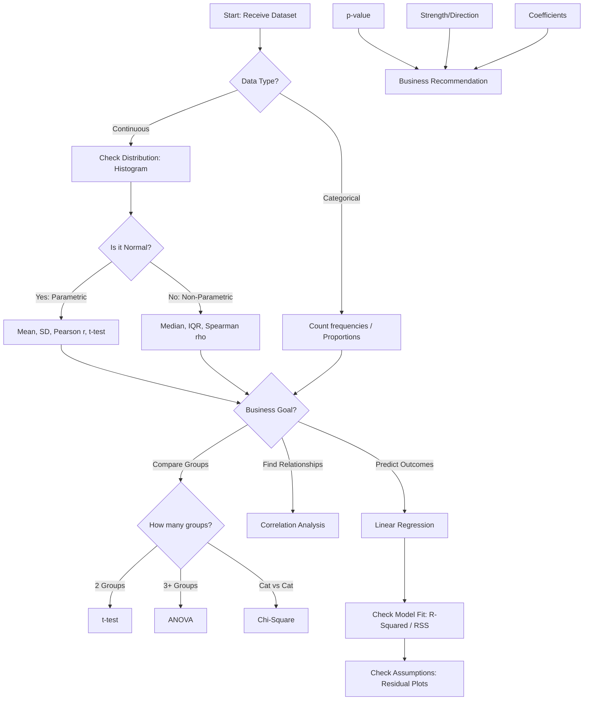
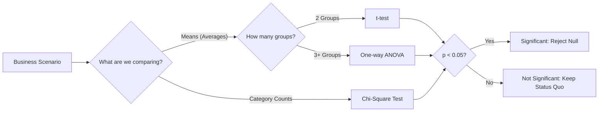
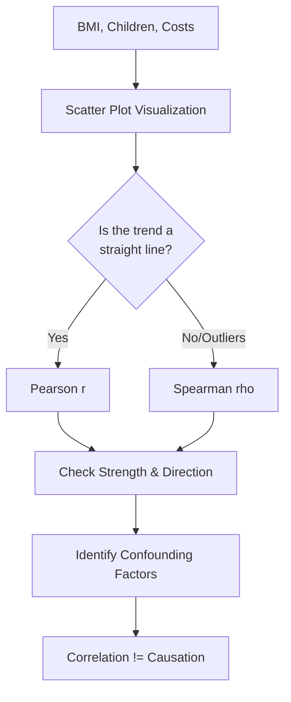
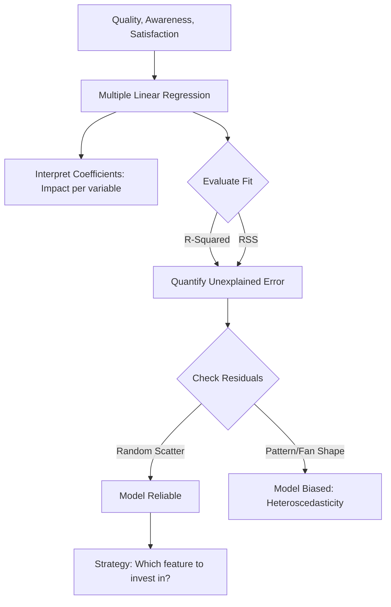

# Data Science Portfolio: Statistical Methods & Predictive Modeling

> **Week 2: From Intuition to Evidence-Based Decision Making**

## 🧭 Project Overview

This repository contains a series of technical analyses focused on applying advanced statistical techniques to solve business problems. The goal of this work is to move beyond "gut feeling" and use mathematical rigor to validate assumptions, identify patterns, and predict future outcomes.

## 🛠️ Skills Demonstrated

* **Hypothesis Testing:** -tests, ANOVA, and Chi-Square analysis.
* **Correlation:** Pearson () and Spearman () coefficients for relationship mapping.
* **Regression:** Simple and Multiple Linear Regression using OLS (Ordinary Least Squares).
* **Model Evaluation:** Interpreting , Adjusted , and RSS (Residual Sum of Squares).
* **Risk Assessment:** Evaluating Sensitivity vs. Specificity and Prediction Intervals.

---

## Decision Logic Flow

The following diagram illustrates the decision-making framework used throughout these activities to select the appropriate statistical test based on data types and business goals.

---

## Portfolio Activities

###  Activity 2.1.3: Hypothesis Testing

* **Objective:** Validate business assumptions across five scenarios (Price, Productivity, Market Research, QC, and Product Lines).
* **Technical Implementation:** Utilized `scipy.stats` to perform t-tests and ANOVA.
* **Key Insight:** Separated "signal" from "noise" by interpreting -values against a significance level () of **0.05**.

### 🔗 Activity 2.2.3: Interpreting Correlation

* **Objective:** Analyze lifestyle impacts (BMI, children) on medical insurance costs for an investment firm.
* **Technical Implementation:** Computed Pearson and Spearman coefficients; visualized relationships via Seaborn scatterplots.
* **Key Insight:** Identified confounding variables (like Age) to avoid the "Correlation implies Causation" fallacy.

### 📈 Activity 2.3.5: Building Predictive Models

* **Objective:** Predict customer loyalty for a national retailer based on product quality and brand awareness.
* **Technical Implementation:** Built a Multiple Linear Regression model using `statsmodels` and `scikit-learn`.
* **Evaluation:** Optimized the model by minimizing RSS and analyzing Adjusted  to prevent overfitting.
* **Business Impact:** Provided coefficient-based insights (e.g., "A 1-unit increase in perceived quality yields a  increase in loyalty").

---

## Assumption & Diagnostic Checks

To ensure model reliability, I performed the following diagnostic checks:

* **Homoscedasticity:** Verified constant variance in residuals to ensure consistent prediction accuracy.
* **Multicollinearity:** Screened independent variables to ensure they were not redundant.
* **Prediction Intervals:** Provided a range for new observations to account for individual variability.

---

## Technologies Used

* **Language:** Python 3.x
* **Libraries:** `Pandas`, `NumPy`, `Matplotlib`, `Seaborn`, `Scipy.stats`, `Statsmodels`, `Scikit-Learn`
* **Documentation:** Mermaid.js, Markdown

